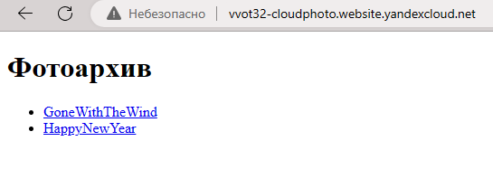
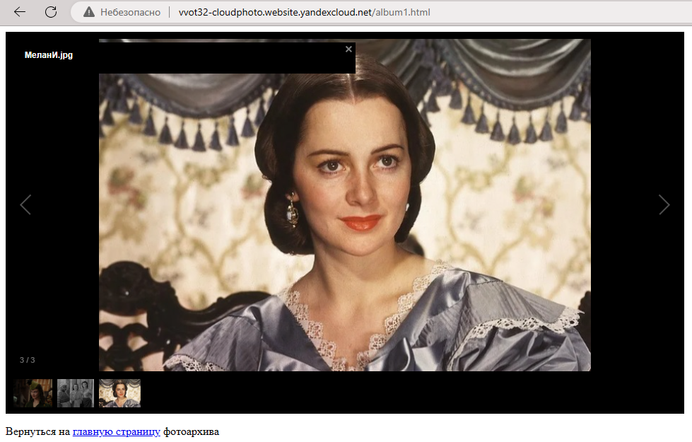
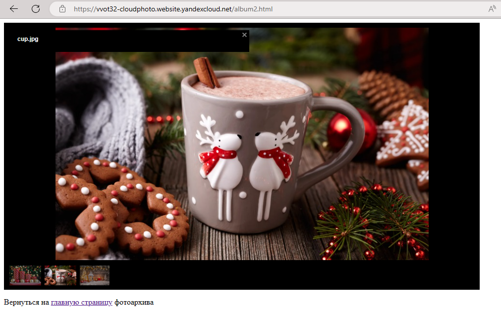

# Homework 2. Command Line App "Photo Archive"

### *Savincheva Angelina, 11-001*

## Sample Photo Archive
* A sample photo archive is available at: [Photo Archive](http://vvot32-cloudphoto.website.yandexcloud.net/)

## Running Instructions
1. Clone this repository

```
git clone https://github.com/asanvlit/Yandex-Cloud-2023-Cloudphoto.git
```

2. Go to the cloned repository folder
3. Run

```
python setup.py install
```

4. If during installation an error like "UnicodeDecodeError: 'charmap' codec can't decode byte 0x98 in position 401: 
character maps to <undefined>" appears, then delete the text inside the README.md file

## Functionality demonstration





